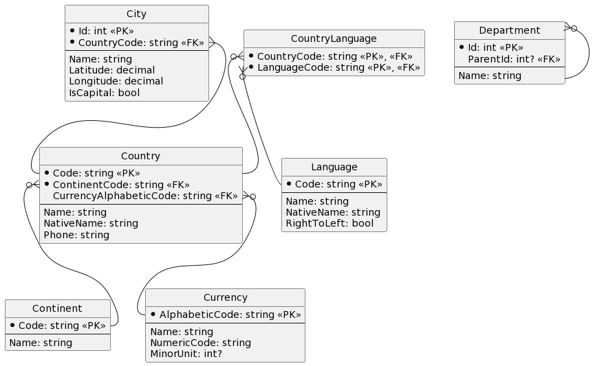

# EntityFrameworkCore Schema
[DbContext](#dbcontext) and [models](../#models) models for this example are defined in the [Epam.GraphQL.Samples.Data project](../samples/Epam.GraphQL.Samples.Data/).
## Diagram

## Models

### Continent

```csharp
public class Continent
{
	public string Code { get; set; }
	public string Name { get; set; }
	public ICollection<Country> Countries { get; set; }
}
```

### Language

```csharp
public class Language
{
	public string Code { get; set; }
	public string Name { get; set; }
	public string NativeName { get; set; }
	public bool RightToLeft { get; set; }
	public ICollection<CountryLanguage> Countries { get; set; }
}
```

### Currency

```csharp
public class Currency
{
	public string Name { get; set; }
	public string AlphabeticCode { get; set; }
	public string NumericCode { get; set; }
	public int? MinorUnit { get; set; }
	public ICollection<Country> Countries { get; set; }
}
```

### Country

```csharp
public class Country
{
	public string Code { get; set; }
	public string Name { get; set; }
	public string NativeName { get; set; }
	public string Phone { get; set; }
	public string ContinentCode { get; set; }
	public string CurrencyAlphabeticCode { get; set; }
	public ICollection<CountryLanguage> Languages { get; set; }
	public Continent Continent { get; set; }
	public Currency Currency { get; set; }
	public ICollection<City> Cities { get; set; }
}
```

### City

```csharp
public class City
{
	public int Id { get; set; }
	public string Name { get; set; }
	public decimal Latitude { get; set; }
	public decimal Longitude { get; set; }
	public string CountryCode { get; set; }
	public Country Country { get; set; }
	public bool IsCapital { get; set; }
}
```

### CountryLanguage

```csharp
public class CountryLanguage
{
	public string CountryCode { get; set; }
	public string LanguageCode { get; set; }
	public Country Country { get; set; }
	public Language Language { get; set; }
}
```

### Department

```csharp
public class Department
{
    public int Id { get; set; }
    public string Name { get; set; }
    public int? ParentId { get; set; }
    public Department Parent { get; set; }
    public ICollection<Department> Children { get; set; }
}
```

## DbContext

```csharp
public class GraphQLDbContext : DbContext
{
    // ...
    
	public DbSet<Language> Languages { get; set; }
	public DbSet<Continent> Continents { get; set; }
	public DbSet<Country> Countries { get; set; }
	public DbSet<Currency> Currencies { get; set; }
	public DbSet<CountryLanguage> CountryLanguages { get; set; }
	public DbSet<City> Cities { get; set; }
	public DbSet<Department> Departments { get; set; }

    // ...

	protected override void OnModelCreating(ModelBuilder modelBuilder)
	{
		modelBuilder.Entity<Language>(
			entity => entity.HasKey(l => l.Code));

		modelBuilder.Entity<Continent>(
			entity => entity.HasKey(c => c.Code));

		modelBuilder.Entity<Currency>(
			entity => entity.HasKey(c => c.AlphabeticCode));

		modelBuilder.Entity<Country>(
			entity =>
			{
				entity.HasKey(c => c.Code);

				entity
					.HasOne(c => c.Currency)
					.WithMany(c => c.Countries)
					.HasForeignKey(c => c.CurrencyAlphabeticCode);

				entity
					.HasOne(c => c.Continent)
					.WithMany(c => c.Countries)
					.HasForeignKey(c => c.ContinentCode)
					.IsRequired();
			});

		modelBuilder.Entity<CountryLanguage>(
			entity =>
			{
				entity.HasKey(l => new
				{
					l.CountryCode,
					l.LanguageCode,
				});

				entity.HasOne(l => l.Country)
					.WithMany(c => c.Languages)
					.HasForeignKey(l => l.CountryCode);

				entity
					.HasOne(l => l.Language)
					.WithMany(l => l.Countries)
					.HasForeignKey(l => l.LanguageCode);
			});

		modelBuilder.Entity<City>(
			entity =>
			{
				entity.HasKey(c => c.Id);

				entity
					.HasOne(c => c.Country)
					.WithMany(c => c.Cities)
					.HasForeignKey(c => c.CountryCode);
			});

		modelBuilder.Entity<Department>(
			entity =>
			{
				entity
					.HasOne(u => u.Parent)
					.WithMany(u => u.Children)
					.HasForeignKey(u => u.ParentId);

				entity
					.HasOne(d => d.CreatedBy)
					.WithMany()
					.HasForeignKey(d => d.CreatedById);

				entity
					.HasOne(d => d.ModifiedBy)
					.WithMany()
					.HasForeignKey(d => d.ModifiedById);
			});

    }
}
```

## Execution Context

```csharp
public class GraphQLExecutionContext
{
    public GraphQLDbContext DbContext { get; set; }
}
```

## Data

Suppose the underlying model's tables contain the following data:

### Continent Data

| Code | Name          |
| ---- | ------------- |
| AF   | Africa        |
| AN   | Antarctica    |
| AS   | Asia          |
| ...  | ...           |
| SA   | South America |

### Language Data

| Code | Name      | NativeName | RightToLeft |
| ---- | --------- | ---------- | ----------- |
| pi   | Pali      | Pāli / पाऴि | `false`     | 
| ny   | Chichewa  | Chi-Chewa  | `false`     | 
| oc   | Occitan   | Occitan    | `false`     | 
| ...  | ...       | ...        | ...         |
| ho   | Hiri Motu | Hiri Motu  | `false`     | 

### Currency Data

| AlphabeticCode | Name           | NumericCode | MinorUnit |
|----------------|----------------|-------------|----------:|
| NGN            | Naira          | 566         |         2 | 
| OMR            | Rial Omani     | 512         |         3 | 
| PKR            | Pakistan Rupee | 586         |         2 | 
| ...            | ...            | ...         |       ... | 
| XPF            | CFP Franc      | 953         |         0 | 

### Country Data

| Code | Name                  | NativeName          | Phone  | ContinentCode | CurrencyAlphabeticCode |
|------|-----------------------|---------------------|--------|---------------|------------------------|
| ST   | São Tomé and Príncipe | São Tomé e Príncipe | 239    | AF            | `null`                 | 
| HK   | Hong Kong             | 香港                 | 852    | AS            | HKD                    | 
| HU   | Hungary               | Magyarország        | 36     | EU            | HUF                    | 
| ...  | ...                   | ...                 | ...    | ...           | ...                    | 
| BM   | Bermuda               | Bermuda             | 1441   | NA            | BMD                    | 

### City Data

| Id       | Name            | Latitude | Longitude | CountryCode | IsCapital |
|---------:|-----------------|---------:|----------:|-------------|-----------|
| 14256    | Āzādshahr       | 34.79049 |  48.57011 | IR          | `false`   | 
| 23814    | Kahrīz          |  34.3838 |   47.0553 | IR          | `false`   | 
| 53654    | Mogadishu       |  2.03711 |  45.34375 | SO          | `true`    |
| ...      | ...             | ...      | ...       | ...         | ...       | 
| 10630176 | Pasragad Branch | 34.77772 |  48.47168 | IR          | `false`   | 

### CountryLanguage Data

| CountryCode | LanguageCode |
|-------------|--------------|
| GU	      | es           |
| MP          | en           |
| AX	      | sv           |
| ...         | ...          |
| KG	      | ky           |

### Department Data

|   Id | Name  | ParentId |
| ---: | ----- | -------: |
|    1 | Alpha |   `null` |
|    2 | Beta  |        1 |
|    3 | Gamma |        1 |