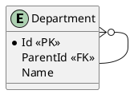

# EntityFrameworkCore Schema

## Diagram


## Models

### Department

```csharp
public class Department
{
    public int Id { get; set; }
    public string Name { get; set; }
    public int? ParentId { get; set; }
    public Department Parent { get; set; }
    public ICollection<Department> Children { get; set; }
}
```

## DbContext

```csharp
public class GraphQLDbContext : DbContext
{
    public DbSet<Department> Departments { get; set; }

        protected override void OnModelCreating(ModelBuilder modelBuilder)
        {
            modelBuilder.Entity<Department>(
                entity =>
                {
                    entity
                        .HasOne(u => u.Parent)
                        .WithMany(u => u.Children)
                        .HasForeignKey(u => u.ParentId);
                });
        }
}
```

## Execution Context
```csharp
public class GraphQLExecutionContext
{
    public GraphQLDbContext DbContext { get; set; }
}
```

## Data
Suppose the underlying model's tables contain the following data:

### Department Data

|   Id | Name  | ParentId |
| ---: | ----- | -------: |
|    1 | Alpha |   `null` |
|    2 | Beta  |        1 |
|    3 | Gamma |        1 |

